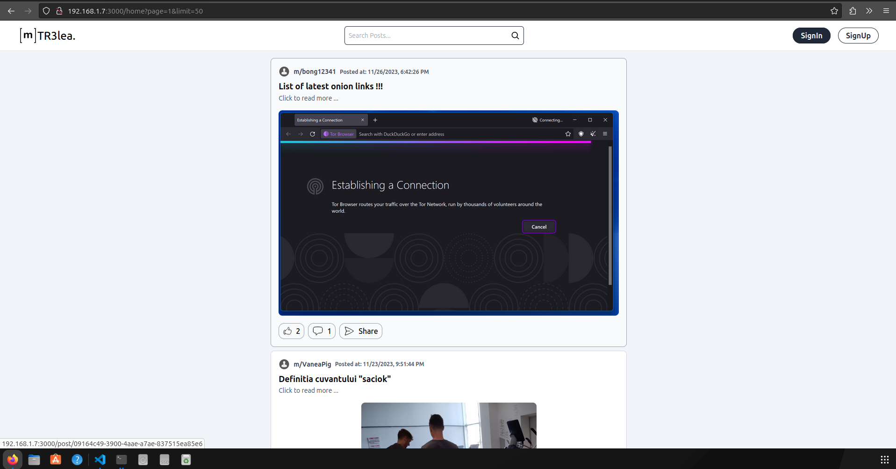

# [m]TR3lea Social Media Platform

Welcome to __[m]TR3lea__, a cutting-edge social media platform that focuses on sharing and engaging with Interesting Announcements. Built with the powerful __PERN__ stack (PostgreSQL, Express.js, React.js, and Node.js), __[m]TR3lea__ combines a seamless user experience with robust features.

This is a full stack application which was built using __PERN__ stack. Main fundamental functionalities such as account support, posting, and commenting have been implemented. The application authenticates users using JWT tokens. Users are able to edit information relating to their account. Users are also allowed to change their avatar images and posts thumbnails. All media files in this application are stored on Backend VPS, all users data is encrypted and stored in PostgreSQL DataBase.

Check Project On: https://trelea-web.netlify.app

## Technologies Used

- ### Front-end Development:
    - Javascript
    - React.js Library
    - TailwindCSS CSS Framework for a sleek and responsive design
    - React-Query for efficient API fetching
    - React-Router for url routes

- ### Back-end Development:
    - Javascript
    - Structured Query Language (SQL) DB building
    - Pyhton for automation testing 
    - PostgreSQL as the main database
    - PG module as ORM for interaction between express and PostgreSQL
    - Express.js for building API endpoints, controllers, middlewares, routes...
    - Nodemailer for OTP verification code.
    - JWT (JSON Web Tokens) for authentication.

## Authentication

__[m]TR3lea__ employs secure authentication operations managed by the Auth API controllers. __JWT__ (JSON Web Tokens) are used for secure authentication. Here are the endpoints for authentication apis:

- ### /signup and /signin :
    - Complementary APIs for creating a new account and verifying the user. __/signup__ -> call server for sending an OTP code on user email inputs to verify if its real email.

- ### /signin:
    - Log in to an existing user account securely.

- ### /signout:
    - Log out from the current account.

These authentication and validation APIs are available in the [m]TR3lea BackEnd repository.

## CRUD Operations

The logic for creating, reading, updating, and deleting (CRUD) operations is controlled by the CRUD APIs. These APIs enable users to post Interesting Announcements, like them, and comment on them, fostering a dynamic and engaging environment. CRUD APIs available in the [m]TR3lea BackEnd repository.

## Data Storage and Security

User authentication data is stored securely in an encrypted string in a cookie session. This session is sent by the server to the React client, and the data is saved in cookies on the user's browser. This ensures both security and convenience in managing user sessions.

## Getting Started  

### To get started with __[m]TR3lea__, follow these steps:

#### 1. Clone the __[m]TR3lea__ FrontEnd repository:
    git clone https://github.com/trelea/MTR3lea-FrontEnd.git

#### 2. Clone the [m]TR3lea BackEnd repository for access to all APIs.
    git clone https://github.com/trelea/MTR3lea-BackEnd.git

#### 3. Set up the PostgreSQL database.

#### 4. Install the necessary dependencies using npm.
    cd ./MTR3lea-FrontEnd && npm install --save
    cd ./MTR3lea-BackEnd && npm install --save

#### 5. Run the application and start exploring the world of [m]TR3lea.
    MTR3lea-FrontEnd$ npm start &&
    MTR3lea-BackEnd$ npm start

Explore the __[m]TR3lea__ community, share your Interesting Announcements, and engage with other users in a secure and user-friendly environment.

For more details, check out the __[m]TR3lea__ BackEnd repository: https://github.com/trelea/MTR3lea-BackEnd.git.

Happy __[m]TR3lea-ing! 🚀__